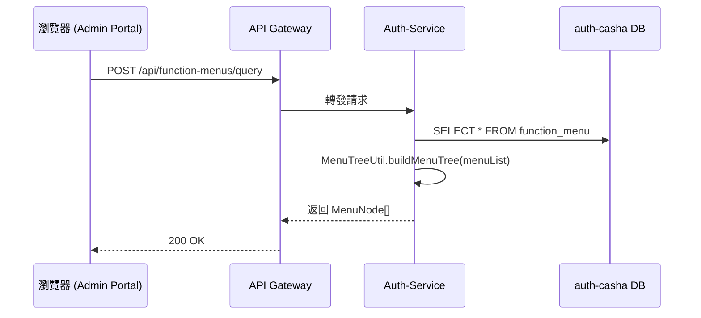
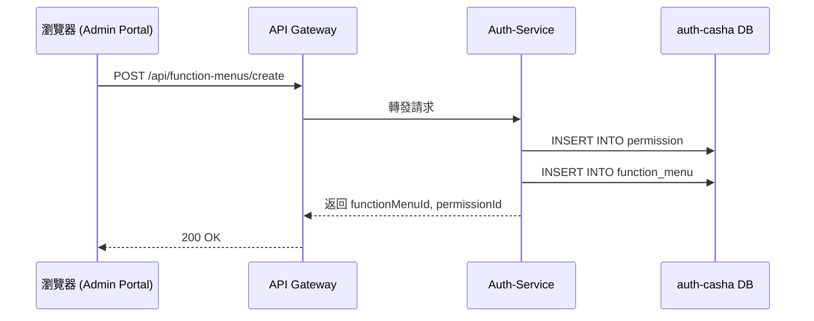

# 權限與功能清單設定

Admin Portal 登入後呼叫此 API 查詢該使用者的功能清單，回傳樹狀結構。資料來源為 function_menu 資料表，透過後端建構為巢狀節點結構（含父子層級），回傳給前端作為側邊欄功能清單。

## Version

| version | 時間 | 作者 | 內容  |
| ------ | ------ | -------| -------|
| 1 | 2025/07/28 | William | 建立 Function Menu 查詢（全量載入）  |
| 2 | 2025/07/28 | William | 建立 Function Menu 新增  |

## API Function Menu 查詢（全量載入）

| 調用方          | API/動作                           | 接收方          | 中間件 | 資料                 |
| ------------ | -------------------------------- | ------------ | --- | ------------------ |
| Admin Portal | `POST /function-menus/query` | Auth-Service | 無   | function\_menu 資料表 |

### API flow



### Req, Res

#### Request

```json
// RequestBody
{}
```

#### Response

```json
{
  "code": "SUCCESS",
  "message": "操作成功",
  "data": [
    {
      "id": 856133635932178,
      "name": "分店管理",
      "path": "/branch",
      "component": null,
      "icon": "icon-branch",
      "type": "MENU",
      "permissionCode": null,
      "children": [
        {
          "id": 856133640126464,
          "name": "分店資訊",
          "path": "/branch/info",
          "component": "BranchInfoView",
          "icon": null,
          "type": "MENU",
          "permissionCode": "BRANCH_VIEW",
          "children": [],
          "sortOrder": 1,
          "navigational": false
        }
      ]
    }
  ]
}

```

### 業務邏輯

1. Controller：FunctionMenuController.queryFunctionMenus 接收空參數物件 FunctionMenuQueryRq
2. 呼叫 UseCase：ManageFunctionUseCase.queryAllMenus()
3. UseCaseImpl：
   1. 透過 FunctionMenuRepository.findAll() 查詢所有 FunctionMenuEntity
   2. 呼叫 MenuTreeUtil.buildMenuTree() 建立樹狀結構
   3. 回傳 List<MenuNode>
   4. Controller 將 List<MenuNode> 包裝為 FunctionMenuQueryRs 回應
4. 使用 ApiResponse.success(...) 統一格式回傳


## API Function Menu 建立（含權限）

| 調用方          | API/動作                            | 接收方          | 中間件 | 資料來源                           |
| ------------ | --------------------------------- | ------------ | --- | ------------------------------ |
| Admin Portal | `POST /function-menus/create` | Auth-Service | 無   | function\_menu, permission 資料表 |

### API flow



### Request

若 parentId 為 null 則建立根節點
欄位 isActive 預設為 1，不需傳入

```json
{
  "permission": {
    "code": "ORDER_VIEW",
    "name": "查看訂單",
    "description": "僅可檢視訂單，不可操作",
    "category": "SYSTEM",
    "scope": "ADMIN_PORTAL",
    "dataScope": "SAAS"
  },
  "functionMenu": {
    "name": "訂單查詢",
    "path": "/orders",
    "component": "OrderView",
    "icon": "icon-order",
    "type": "MENU",
    "parentId": 856133635932178
  }
}
```

### Response

```json
{
  "code": "SUCCESS",
  "message": "操作成功",
  "data": {
    "permissionId": 1002340230483,
    "functionMenuId": 2002834029384
  }
}
```

### 業務邏輯

1. Controller：FunctionMenuController.createFunctionMenu(CreateFunctionMenuRq)
2. 呼叫 UseCase：ManageFunctionUseCase.create(...)
3. UseCaseImpl：
   1. 檢查 permission 是否重複（可選）
   2. 建立 PermissionEntity 並保存至 DB
   3. 查詢該 parentId 的最大 sortOrder（若無 parentId，則查全部根節點）
   4. 自動產生新的排序值（最大值 + 1）
   5. 建立 FunctionMenuEntity，包含綁定 permission code、預設 isActive = 1
   6. 儲存 function_menu
   7. 回傳 permissionId 與 functionMenuId
4. Controller 回傳 ApiResponse.success(CreateFunctionMenuRs)
