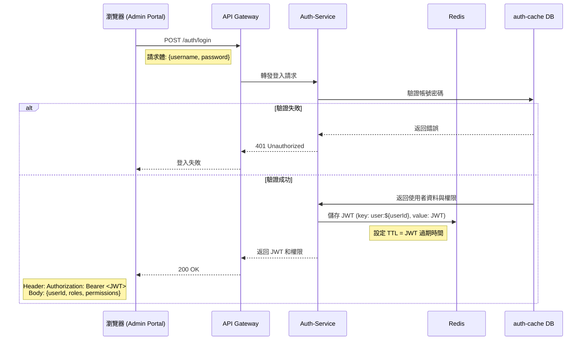

# SaaS Login

Saas 平台帳號密碼登入，登入成功後生成 JWT, 在 Redis 內儲存, 並由 Header 返回 JWT；JWT 內包含使用者基本訊息與權限清單。

## Version

| version | 時間 | 作者 | 內容  |
| ------ | ------ | -------| -------|
| 1 | 2025/07/20 | William | 建立 login 機制, 不含 refresh token  |

## API

| 調用方 | API/動作 | 接收方  | 中間件 |  資料  | 
| ------ | -------| -------| -------| -------|
| Admin Portal | `POST /auth/login` | Auth-Service | Redis| auth-casha DB |

## Flow



## Req, Res

### Request

```json
// RequestBody
{
    "username": "string",
    // NotBlank, 需要包含 @ 符號
    "passwd": "string"
    // NotBlank, min = 6, max = 12, regexp = "[a-zA-Z0-9]+"
}
```

### Response

```json
Header: Authorization: Bearer <token>
JWT Payload:
{
  "sub": "userId",
  "username": "admin@google.com",
  "role": "ADMIN", 
  "exp": 1721450400
}

Body
{
  "userId": "string",
  "username": "string",
  "roles": "string",
  "accessToken": "string",
  "menus": [
            {
                "id": 856133635932178,
                "name": "分店管理",
                "path": "/branch",
                "component": null,
                "icon": "icon-branch",
                "type": "MENU",
                "permissionCode": null,
                "children": [
                    {
                        "id": 856133640126464,
                        "name": "分店資訊",
                        "path": "/branch/info",
                        "component": "BranchInfoView",
                        "icon": null,
                        "type": "MENU",
                        "permissionCode": "BRANCH_VIEW",
                        "children": [],
                        "sortOrder": 1,
                        "navigational": false
                    }
                ]
            }
  ]
}
```

## 業務邏輯

1. 驗證帳號密碼是否和規
2. 以帳號查詢 User Entity
   1. 資料為 rst_user.username, rst_user.password_hash, rst_user.status
   2. 若為空, 拋出 `AuthServiceException.AuthServiceErrorType.USER_NOT_FOUND`
3. 驗證帳號密碼
   1. 若登入失敗, 拋出 `AuthServiceException.AuthServiceErrorType.ACCOUNT_PASSWD_NOT_MATCH`, 紀錄登入錯誤次數
      1. 紀錄登入錯誤次數: Redis 內設定 Key "auth:fail:" + accountNo, 值為登入失敗次數
   2. 若帳號被鎖定, 拋出 `AuthServiceException.AuthServiceErrorType.ACCOUNT_BANNED`
   3. 若帳號登入失敗三次，阻擋 20 分鐘
      1. 失敗三次, Redis 內設定 Key "auth:lock:" + accountNo
      2. 拋出 `AuthServiceException.AuthServiceErrorType.LOGIN_FAIL_OVER_THREE_TIME`
4. 成功登入, 清除登入錯誤紀錄, 產生 JWT
   1. 使用 SaaSJWTUtil.generateToken
5. 儲存 JWT 到 Redis, Redis 內設定 Key "jwt:" + accountNo;
6. 返回 JWT, Request Body, 並更新最後登入時間 rst_user.last_login_at

> 註記: 重新登入後會更新 Redis 內的 token, 使其他裝置失效, 為後踢前機制
