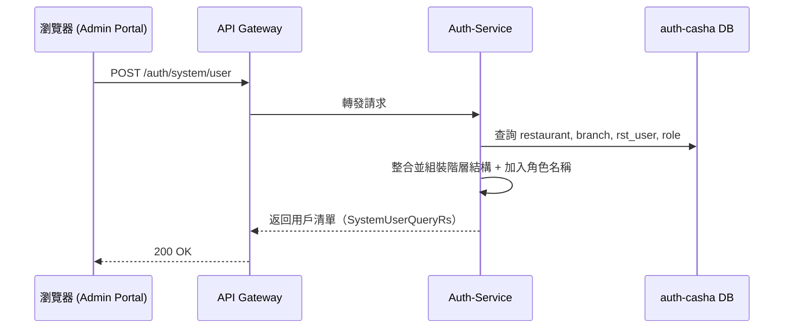

# 系統用戶管理

## 用戶清單查詢

Admin Portal 登入後呼叫此 API 以查詢目前系統中的所有餐廳 > 分店 > 用戶資訊，並包含該用戶所屬的角色（若無則標示為「未綁定」）。資料結構為樹狀階層，用於用戶管理頁面。

---

## Version

| version | 時間       | 作者    | 內容                  |
|---------|------------|---------|-----------------------|
| 1       | 2025/07/29 | William | 建立查詢用戶清單 API |
| 2       | 2025/07/29 | William | 建立新增系統用戶 API 規格 |

---

## API：查詢用戶清單（含階層與角色）

| 調用方          | API/動作                 | 接收方      | 中間件     | 資料來源                                 |
|-----------------|--------------------------|-------------|------------|------------------------------------------|
| Admin Portal    | `POST /auth/system/user` | Auth-Service | API Gateway | restaurant、branch、rst_user、role 等資料表 |

---

### API flow



### Request

```json
{}`
```

目前為空物件，預設回傳所有階層資訊。未來可擴充為根據餐廳、角色或用戶狀態進行篩選。

### Response

```json
{
  "code": "SUCCESS",
  "message": "操作成功",
  "data": [
    {
      "id": 1001,
      "name": "王品集團",
      "type": "餐廳",
      "status": 1,
      "level": 0,
      "children": [
        {
          "id": 2001,
          "name": "台北信義店",
          "type": "分店",
          "status": 1,
          "level": 1,
          "children": [
            {
              "id": 3001,
              "name": "張三",
              "username": "zhangsan",
              "type": "用戶",
              "status": 1,
              "level": 2,
              "roleName": "分店管理員"
            },
            {
              "id": 3002,
              "name": "李四",
              "username": "lisi",
              "type": "用戶",
              "status": 0,
              "level": 2,
              "roleName": "未綁定"
            }
          ]
        }
      ]
    }
  ]
}
```
### 欄位說明

| 欄位       | 類型     | 說明                       |
| -------- | ------ | ------------------------ |
| id       | number | 節點 ID（餐廳 / 分店 / 用戶）      |
| name     | string | 名稱（餐廳 / 分店 / 用戶）         |
| username | string | 用戶帳號（type 為用戶時出現）        |
| type     | string | 節點類型：餐廳、分店、用戶            |
| status   | number | 狀態（1 = 啟用，0 = 停用）        |
| level    | number | 層級（0 = 餐廳，1 = 分店，2 = 用戶） |
| roleName | string | 該用戶綁定的角色（無則為「未綁定」）       |
| children | array  | 子節點清單                    |

### 業務邏輯

1. Controller：SystemUserController.querySystemUsers(...) 接收空參數 SystemUserQueryRq
2. 呼叫 UseCase：SystemUserQueryUseCase.queryUsers(rq)
3. UseCaseImpl：
   1. 查詢所有 restaurant、branch、rst_user
   2. 建立階層關聯（依照 restaurant → branch → rst_user）
   3. 針對每個 rst_user 透過 roleRepository 查詢唯一綁定角色
   4. 包裝成樹狀結構 List<SystemUserNode>
   5. 回傳 SystemUserQueryRs 給 Controller
4. Controller 使用 ApiResponse.success(...) 格式統一回應


## 系統用戶管理

新增系統用戶（餐廳與分店）

此 API 用於建立一個新的餐廳及其分店，同時自動建立餐廳帳戶與分店帳戶。系統將同步為兩個帳戶自動建立預設角色（REST_DEFAULT_ADMIN、BRANCH_DEFAULT_ADMIN）並綁定符合權限資料範圍的權限。

