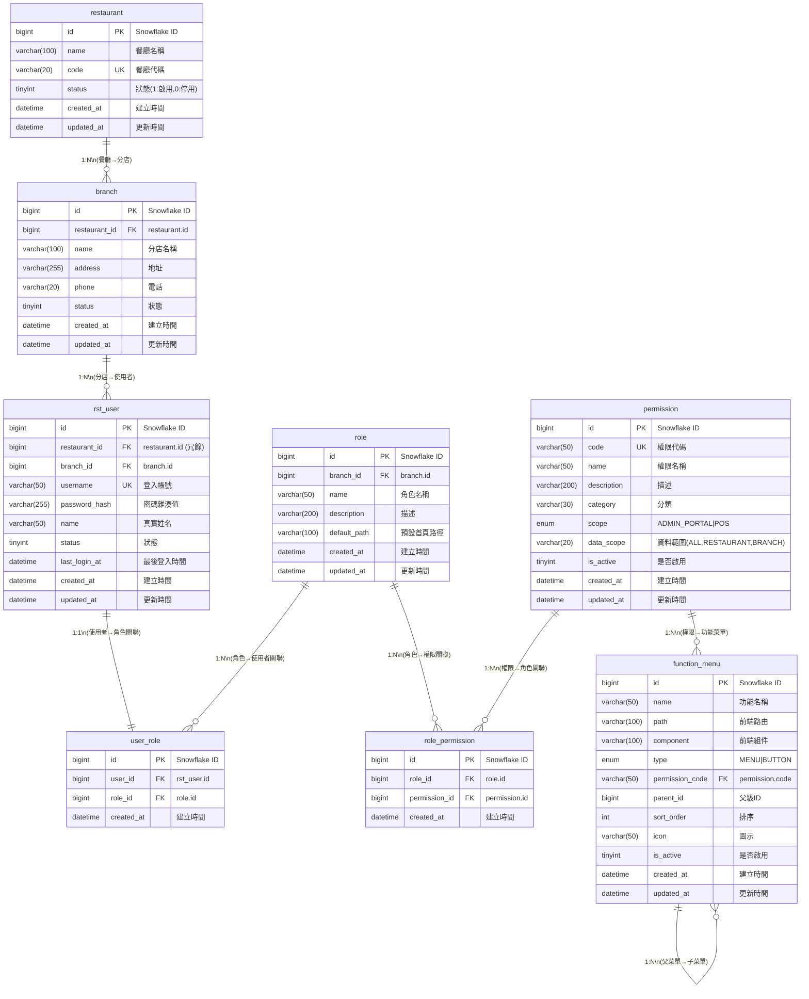
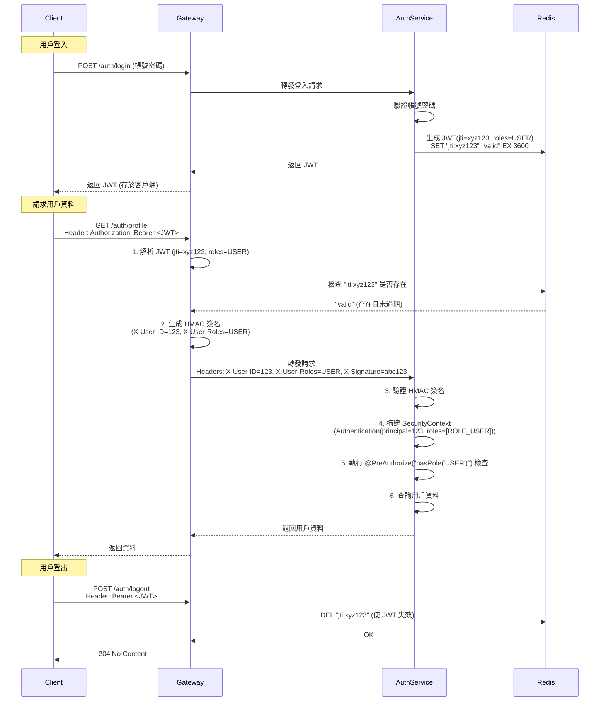

# Role-Based Access Control

Casha 透過 Spring Security 以及 JWT 實現 RBAC 認證機制。

## Role and Permission

餐廳 (Resturant) 以分店 (Branch) 作為單位，旗下可以開通多位用戶 (User)，每位用戶**目前暫定綁訂一個自定義角色(先保留一對多)**，如 Admin(default)、Viewer、Cashier 等；每個角色可以調整在平台上的使用權限。

### 創建與配置流程

1. Flyway 控制初始用戶與權限
   1. SaaS Admin Account
   2. SaaS Permission
   3. Resturant Permission
   4. Branch Permission
2. 餐廳申請帳號
3. 平台審核申請, 創建分店與餐廳級, 分店級管理員用戶
4. 分店級管理員建立角色, 配置 Permissions
5. 分店級管理員建立分店用戶, 綁並角色

### Function & Permissions

功能清單與權限相互關聯, 分別以 [function_menu] [permission] 兩個表控制。

功能由管理員於後台建立 & 測試, 再控制於 flway 內。

## ER Model

## JWT Validation

